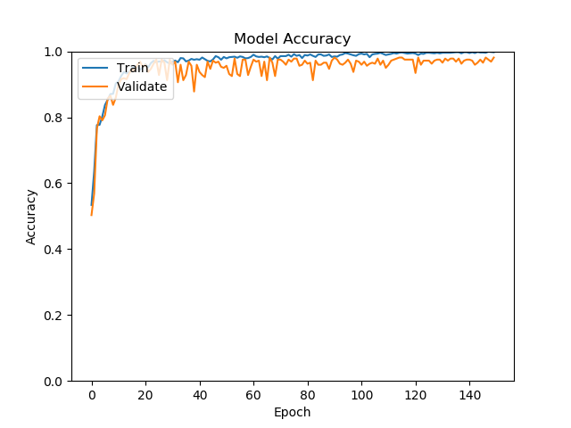
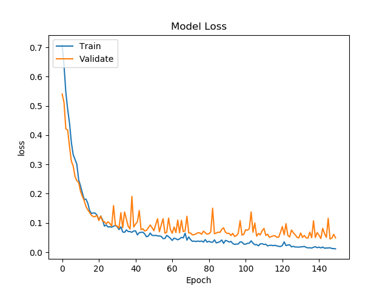
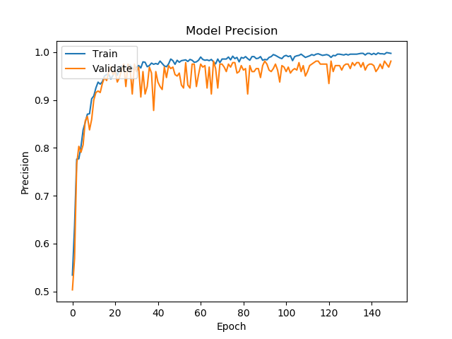
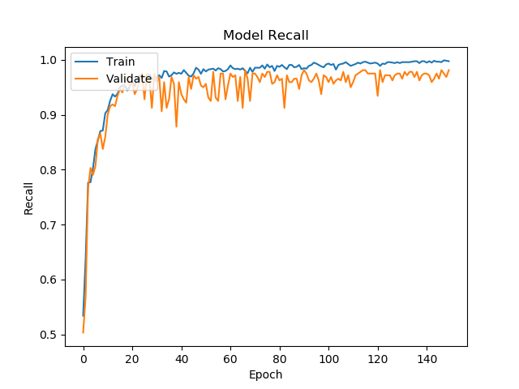
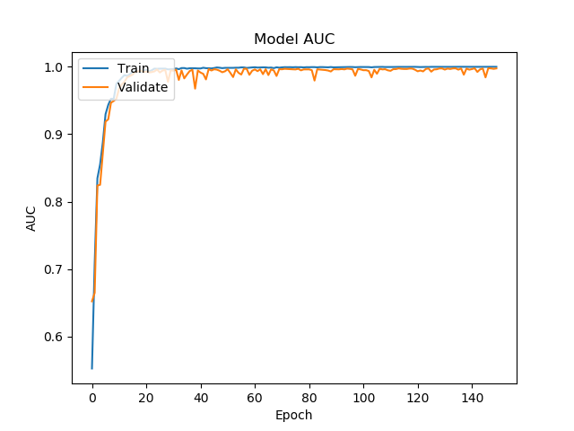

# Peter Moss Acute Myeloid & Lymphoblastic Leukemia AI Research Project

## Acute Lymphoblastic Leukemia Detection System 2020

&nbsp;

# AllDS2020 CNN

## Introduction

This project is the classifier that is used in Acute the Lymphoblastic Leukemia Detection System 2020. The network provided in this project was originally created in [ALL research papers evaluation project](https://github.com/leukemiaresearchassociation/ALL-IDB-Classifiers/blob/master/Python/Tensorflow/2-0/Classification/ALL-Papers/Evaluations/Paper-1.md "ALL research papers evaluation project"), where we replicated the network proposed in the [Acute Leukemia Classification Using Convolution Neural Network In Clinical Decision Support System](https://airccj.org/CSCP/vol7/csit77505.pdf "Acute Leukemia Classification Using Convolution Neural Network In Clinical Decision Support System") paper by Thanh.TTP, Giao N. Pham, Jin-Hyeok Park, Kwang-Seok Moon, Suk-Hwan Lee, and Ki-Ryong Kwon, and the data augmentation proposed in  [Leukemia Blood Cell Image Classification Using Convolutional Neural Network](http://www.ijcte.org/vol10/1198-H0012.pdf "Leukemia Blood Cell Image Classification Using Convolutional Neural Network") by T. T. P. Thanh, Caleb Vununu, Sukhrob Atoev, Suk-Hwan Lee, and Ki-Ryong Kwon. The original project was inspired by the [work](https://github.com/AmlResearchProject/AML-ALL-Classifiers/blob/master/Python/_Keras/QuantisedCode/QuantisedCode.ipynb "work") done by [Amita Kapoor](https://www.petermossamlallresearch.com/team/amita-kapoor/profile "Amita Kapoor") and [Taru Jain](https://www.petermossamlallresearch.com/students/student/taru-jain/profile "Taru Jain") and Adam's [projects](https://github.com/AMLResearchProject/AML-ALL-Classifiers/tree/master/Python/_Keras/AllCNN "projects") based on their work.

_This is a high level tutorial for those that have little to no programming experience allowing them to use the system. In the coming weeks a series of low level articles will be published on our [Medium](https://medium.com/leukemiaairesearch "Medium") for the more experienced developers._

&nbsp;

## Results Overview

We have tested our model on a number of different hardwares, including Intel® CPUs & NVIDIA GPUs. Results seem to vary between CPU & GPU, and tests show further investigation into seeding and randomness introduced to our network via the GPU software. For reproducible results every time, it is suggested to train on a CPU, although this obviously requires more time.

One method to overcome reproducibility issues and get an good idea of how well our model is behaving on GPU would be to test the model multiple times and take an average. This is one way we will explore our model in the future.

Below are the results from individual training sessions.

| OS | Hardware | Training | Validation | Test | Accuracy | Recall | Precision | AUC/ROC |
| -------------------- | -------------------- | -------------------- | ----- | ---------- | ---------- | ---------- | ---------- | ---------- |
| Google Colab | Tesla K80 GPU | 1180 |  404 | 20 |  0.9727723 | 0.9727723 | 0.9727723 | 0.9948964 |
| Windows 10 | NVIDIA GeoForce GTX 1060 | 1180 |  404 | 20 |  0.97066015 | 0.97066015 | 0.97066015 | 0.9908836 |
| Ubuntu 18.04 | NVIDIA GTX 1050 Ti Ti/PCIe/SSE2 | 1180 |  404 | 20 |  0.97772276 | 0.97772276 | 0.97772276 | 0.9945594 |
| Ubuntu 18.04 | Intel® Core™ i7-7700HQ CPU @ 2.80GHz × 8   | 1180 |  404 | 20 |  0.9752475 | 0.9752475 | 0.9752475 | 0.991492 |
| Windows 10 | Intel® Core™ i7-7700HQ CPU @ 2.80GHz × 8   | 1180 |  404 | 20 |  0.9851485 | 0.9851485 | 0.9851485 | 0.9985846 |
| macOS Mojave 10.14.6 | Intel® Core™ i5 CPU @ 2.4 GHz   | 1180 |  404 | 20 |  0.9589041 | 0.9589041 | 0.9589041 | 0.99483955 |

&nbsp;

# Programming Language

- Python 3.7

&nbsp;

# Software 

In this project we have used the following softwares:

- Anaconda
- Tensorflow 2 GPU

&nbsp;

# Installation

## Anaconda

If you haven't already installed Anaconda and set up your conda env and Tensorflow installation, please follow our [Anaconda installation guide](https://github.com/AMLResearchProject/ALL-Detection-System-2020/blob/master/Documentation/Anaconda.md "Anaconda installation guide"). 

## Setup.sh

All other requirements are included in **Setup.sh**. You can run this file on machine by navigating to the **CNN** directory in terminal and using the command below:

```
sh Setup.sh
```

## Windows Installation Issue(s)

If you're working on a Windows 10 machine and facing some issues, please follow our [Windows Issues guide](https://github.com/AMLResearchProject/ALL-Detection-System-2020/blob/master/Documentation/Windows.md "Windows Issues guide"). In case your issue is not mentioned and you're able to solve it, do create a pull request mentioning the same in the aforementioned file.

## AutoPilot Scripts

If you would like to replicate the exact scenarios we tested in or simply like to put the entire process in AutoPilot, please follow our [AutoPilot guide](https://github.com/AMLResearchProject/ALL-Detection-System-2020/blob/master/Documentation/AutoPilot.md "AutoPilot guide"). 

&nbsp;

# Network Architecture


_Fig 1. Proposed architecture ([Source](https://airccj.org/CSCP/vol7/csit77505.pdf "Source"))_

In [Acute Leukemia Classification Using Convolution Neural Network In Clinical Decision Support System](https://airccj.org/CSCP/vol7/csit77505.pdf "Acute Leukemia Classification Using Convolution Neural Network In Clinical Decision Support System"), the authors propose a simple 5 layer Convolutional Neural Network. 

In this project we will use an augmented dataset with the network proposed in this paper, built using Tensorflow 2.

We will build a Convolutional Neural Network, as shown in Fig 1, consisting of the following 5 layers (missing out the zero padding layers). Note we are usng an conv sizes of (100x100x30) whereas in the paper, the authors use (50x50x30).

- Conv layer (100x100x30)
- Conv layer (100x100x30)
- Max-Pooling layer (50x50x30)
- Fully Connected layer (2 neurons)
- Softmax layer (Output 2)

&nbsp;

# Getting Started

To get started make sure you completed the steps on the [project home README](https://github.com/AMLResearchProject/ALL-Detection-System-2020 "project home README").

## Data

Once you have your data you need to add it to the project filesystem. You will notice the data folder in the Model directory, **Model/Data**, inside you have **Train** & **Test**. 

We will created an augmented dataset based on the [Leukemia Blood Cell Image Classification Using Convolutional Neural Network](http://www.ijcte.org/vol10/1198-H0012.pdf "Leukemia Blood Cell Image Classification Using Convolutional Neural Network") by T. T. P. Thanh, Caleb Vununu, Sukhrob Atoev, Suk-Hwan Lee, and Ki-Ryong Kwon. In this case, we will use more rotated images to increase the dataset further.

First take the ten positive and ten negative samples shown below, and place them in the **Model/Data/Test** directory. This will be used by our Oculus Rift application and our testing purposes. You can use any data split you like, to ensure you get the same results please use the same test images and the CPU for training. There is currently an issue when using GPU, most likely due to randomness implemented in the GPU software. It is possible to replicate the results here but it may take more than one attempt at training. This is something we will work on for a future update.

- im006_1.jpg
- im020_1.jpg
- im024_1.jpg
- im026_1.jpg
- im028_1.jpg
- im031_1.jpg
- im035_0.jpg
- im041_0.jpg
- im047_0.jpg
- im053_1.jpg
- im057_1.jpg
- im060_1.jpg
- im063_1.jpg
- im069_0.jpg
- im074_0.jpg
- im088_0.jpg
- im095_0.jpg
- im099_0.jpg
- im101_0.jpg
- im106_0.jpg

Next add the remaining 88 images to the **Model/Data/Train** folder. The test images used will not be augmented.

## Code structure

The code for this project consists of 5 main Python files and a configuration file:

- [config.json](https://github.com/AMLResearchProject/ALL-Detection-System-2020/tree/master/CNN/Model/config.json "config.json"): The configuration file.
- [AllDS2020.py](https://github.com/AMLResearchProject/ALL-Detection-System-2020/tree/master/CNN/AllDS2020.py "AllDS2020.py"): Core classifier wrapper class.
- [Helpers.py](https://github.com/AMLResearchProject/ALL-Detection-System-2020/tree/master/CNN/Classes/Helpers.py "Helpers.py"): A helpers class.
- [Data.py](https://github.com/AMLResearchProject/ALL-Detection-System-2020/tree/master/CNN/Classes/Data.py "Data.py"): A data helpers class.
- [Augmentation.py](https://github.com/AMLResearchProject/ALL-Detection-System-2020/tree/master/CNN/Classes/Augmentation.py "Augmentation.py"): An augmentation helpers class.
- [Model.py](https://github.com/AMLResearchProject/ALL-Detection-System-2020/tree/master/CNN/Classes/Model.py "Model.py"): A model helpers class.
- [Server.py](https://github.com/AMLResearchProject/ALL-Detection-System-2020/tree/master/CNN/Classes/Server.py "Server.py"): A server helpers class.

### Classes 

Our functionality for this network can be found mainly in the **Classes** directory. 

- [Helpers.py](https://github.com/AMLResearchProject/ALL-Detection-System-2020/tree/master/CNN/Classes/Helpers.py "Helpers.py") is a helper class. The class loads the configuration and logging that the project uses.
- [Data.py](https://github.com/AMLResearchProject/ALL-Detection-System-2020/tree/master/CNN/Classes/Data.py "Data.py") is a data helper class. The class provides the functionality for sorting and preparing your training and validation data.
- [Augmentation.py](https://github.com/AMLResearchProject/ALL-Detection-System-2020/tree/master/CNN/Classes/Augmentation.py "Augmentation.py") is a augmentation helper class, The class provides functionality for data augmentation.
- [Model.py](https://github.com/AMLResearchProject/ALL-Detection-System-2020/tree/master/CNN/Classes/Model.py "Model.py") is a model helper class. The class provides the functionality for creating our CNN. 
- [Server.py](https://github.com/AMLResearchProject/ALL-Detection-System-2020/tree/master/CNN/Classes/Server.py "Server.py") is a server helpers class. The class provides the functionality for creating our CNN 


#### Functions

 The main functions are briefly explained below:

 ##### Data.py

- **do_im_process()** - The do_im_process() function augments and prepares the data.
- **convert_data()** - The convert_data() function converts the training data to a numpy array.
- **encode_labels()** - The encode_labels() function One Hot Encodes the labels.
- **shuffle()** - The shuffle() function shuffles the data helping to eliminate bias.
- **get_split()** - The get_split() function splits the prepared data and labels into training and validation data.
- **resize()** - The resize() function resizes an image.

 ##### Augmentation.py

- **grayscale()** The grayscale() function creates a grayscale copy of an image.
- **equalize_hist()** The equalize_hist() function creates a histogram equalized copy of an image.
- **reflection()** The reflection() function creates a horizontally and vertically reflected copies of an image.
- **gaussian()** The gaussian() function creates a gaussian blurred copy of an image.
- **translate()** The translate() function creates a translated copy of an image.
- **rotation()** The rotation() function creates rotated copy/copies of an image.
- **shear()** The shear() function creates sheared copy of an image.

 ##### Model.py

- **do_data()** The do_data() creates an augmented dataset that we will use for our model training and validation.
- **do_network()** The do_network() function creates the network architecture proposed in the [Acute Leukemia Classification Using Convolution Neural Network In Clinical Decision Support System](https://airccj.org/CSCP/vol7/csit77505.pdf "Acute Leukemia Classification Using Convolution Neural Network In Clinical Decision Support System") paper.
- **do_train()** The do_train() function compiles and trains the model.
- **do_evaluate()** The do_evaluate() function evaluates the model, and displays the values for the metrics we specified.
- **do_predictions()** The do_predictions() function makes predictions on the train & test sets.
- **visualize_metrics()** The visualize_metrics() function allows you to visualize and save the metrics plot images.
- **confusion_matrix()** The confusion_matrix() function allows you to visualize the confusion matrix.
- **figures_of_merit()** The figures_of_merit() calculates the figures of merit requested on the ALL-IDB website.
- **save_weights()** The save_weights() saves the model weights.
- **save_model_as_json()** The save_model_as_json() saves the model as JSON.
- **load_model_and_weights()** The load_model_and_weights() loads the trained model and weights.
- **test_classifier()** The test_classifier() tests the classifier using the test data set.
- **send_request()** The send_request() sends a HTTP request.
- **test_http_classifier()** The test_http_classifier() tests the server / API by sending the test data to the classifier with the API.
- **http_classify()** The http_classify() classifies an image sent via HTTP.
- **vr_http_classify()** The vr_http_classify() classifies an image sent via from VR via HTTP.
- **get_predictions()** The get_predictions() gets a prediction for an image.
- **reshape()** The reshape() reshapes an image.

 ##### Server.py

- **start()** The start() starts the classification API server.

&nbsp;

# Configuration

[config.json](https://github.com/AMLResearchProject/ALL-Detection-System-2020/tree/master/CNN/Model/config.json "config.json")  holds the configuration for our network. 

```
{
    "cnn": {
        "api": {
            "server": "XXX.XXX.X.XXX",
            "port": 1234
        },
        "core": [
            "Train",
            "Server",
            "Client",
            "Classify"
        ],
        "data": {
            "dim": 100,
            "file_type": ".jpg",
            "labels": [0,1],
            "rotations": 10,
            "seed": 2,
            "split": 0.3,
            "test": "Model/Data/Test",
            "test_data": [
                "im006_1.jpg",
                "im020_1.jpg",
                "im024_1.jpg",
                "im026_1.jpg",
                "im028_1.jpg",
                "im031_1.jpg",
                "im035_0.jpg",
                "im041_0.jpg",
                "im047_0.jpg",
                "im053_1.jpg",
                "im057_1.jpg",
                "im060_1.jpg",
                "im063_1.jpg",
                "im069_0.jpg",
                "im074_0.jpg",
                "im088_0.jpg",
                "im095_0.jpg",
                "im099_0.jpg",
                "im101_0.jpg",
                "im106_0.jpg"
            ],
            "train_dir": "Model/Data/Train",
            "valid_types": [
              ".JPG",
              ".JPEG",
              ".PNG",
              ".GIF",
              ".jpg",
              ".jpeg",
              ".png",
              ".gif"
            ]
        },
        "model": {
            "model": "Model/model.json",
            "weights": "Model/weights.h5"
        },
        "train": {
            "batch": 100,
            "decay_adam": 1e-6,
            "epochs": 150,
            "learning_rate_adam": 1e-4,
            "val_steps": 10
        }
    }
}
```

The cnn object contains 4 Json Objects (api, data, model and train) and a JSON Array (core). Api has the information used to set up your server you will need to add your local ip, data has the configuration related to preparing the training and validation data, model holds the model file paths, and train holds the training parameters. 

In my case, the configuration above was the best out of my testing, but you may find different configurations work better. Feel free to update these settings to your liking, and please let us know of your experiences.

&nbsp;

# Metrics

We can use metrics to measure the effectiveness of our model. In this network we will use the following metrics:

```
tf.keras.metrics.BinaryAccuracy(name='accuracy'),
tf.keras.metrics.Precision(name='precision'),
tf.keras.metrics.Recall(name='recall'),
tf.keras.metrics.AUC(name='auc')
```

These metrics will be displayed and plotted once our model is trained.  A useful tutorial while working on the metrics was the [Classification on imbalanced data](https://www.tensorflow.org/tutorials/structured_data/imbalanced_data) tutorial on Tensorflow's website.

&nbsp;

# Training the model

Now you are ready to train your model. As mentioned above, an Ubuntu machine with an NVIDIA GTX 1050 ti was used. Using different machines/GPU(standalone or integrated)/CPU may vary the results, if so please let us know your findings.

## Start The Training

Ensuring you have completed all previous steps, you can start training using the following command. 

```
python AllDS2020.py Train
```

This tells the classifier to start in Train mode which will start the model training process.

### Data

First the data will be prepared.

```
2020-03-12 04:56:34,566 - Data - INFO - Data shape: (1584, 100, 100, 3)
2020-03-12 04:56:34,568 - Data - INFO - Labels shape: (1584, 2)
2020-03-12 04:56:34,568 - Data - INFO - Raw data: 792
2020-03-12 04:56:34,568 - Data - INFO - Raw negative data: 441
2020-03-12 04:56:34,568 - Data - INFO - Raw positive data: 792
2020-03-12 04:56:34,568 - Data - INFO - Augmented data: (1584, 100, 100, 3)
2020-03-12 04:56:34,568 - Data - INFO - Labels: (1584, 2)
2020-03-12 04:56:34,667 - Data - INFO - Training data: (1180, 100, 100, 3)
2020-03-12 04:56:34,668 - Data - INFO - Training labels: (1180, 2)
2020-03-12 04:56:34,668 - Data - INFO - Validation data: (404, 100, 100, 3)
2020-03-12 04:56:34,668 - Data - INFO - Validation labels: (404, 2)
```

### Model Summary

Our network matches the architecture proposed in the paper exactly, with exception to maybe the optimizer and loss function as this info was not provided in the paper. 

Before the model begins training, we will be shown the model summary, or architecture. 

```
Model: "AllDS2020_TF_CNN"
_________________________________________________________________
Layer (type)                 Output Shape              Param #   
=================================================================
zero_padding2d (ZeroPadding2 (None, 104, 104, 3)       0         
_________________________________________________________________
conv2d (Conv2D)              (None, 100, 100, 30)      2280      
_________________________________________________________________
zero_padding2d_1 (ZeroPaddin (None, 104, 104, 30)      0         
_________________________________________________________________
conv2d_1 (Conv2D)            (None, 100, 100, 30)      22530     
_________________________________________________________________
max_pooling2d (MaxPooling2D) (None, 50, 50, 30)        0         
_________________________________________________________________
flatten (Flatten)            (None, 75000)             0         
_________________________________________________________________
dense (Dense)                (None, 2)                 150002    
_________________________________________________________________
activation (Activation)      (None, 2)                 0         
=================================================================
Total params: 174,812
Trainable params: 174,812
Non-trainable params: 0
_________________________________________________________________

Train on 1180 samples, validate on 404 samples
```

## Training Results

Below are the training results for 150 epochs.



_Fig 2. Ubuntu/GTX 1050 ti Accuracy_



_Fig 3. Ubuntu/GTX 1050 ti Loss_



_Fig 4. Ubuntu/GTX 1050 ti Precision_



_Fig 5. Ubuntu/GTX 1050 ti Recall_



_Fig 6. Ubuntu/GTX 1050 ti AUC_

```
2020-03-12 05:01:34,983 - Model - INFO - Metrics: loss 0.10102711595816187
2020-03-12 05:01:34,984 - Model - INFO - Metrics: acc 0.97772276
2020-03-12 05:01:34,984 - Model - INFO - Metrics: precision 0.97772276
2020-03-12 05:01:34,984 - Model - INFO - Metrics: recall 0.97772276
2020-03-12 05:01:34,984 - Model - INFO - Metrics: auc 0.9945594

2020-03-12 05:01:46,254 - Model - INFO - Confusion Matrix: [[213   4] [  5 182]]

2020-03-12 05:01:47,239 - Model - INFO - True Positives: 182(45.04950495049505%)
2020-03-12 05:01:47,239 - Model - INFO - False Positives: 4(0.9900990099009901%)
2020-03-12 05:01:47,239 - Model - INFO - True Negatives: 213(52.722772277227726%)
2020-03-12 05:01:47,239 - Model - INFO - False Negatives: 5(1.2376237623762376%)
2020-03-12 05:01:47,240 - Model - INFO - Specificity: 0.9815668202764977
2020-03-12 05:01:47,240 - Model - INFO - Misclassification: 9(2.227722772277228%)
```

## Metrics Overview

| Accuracy | Recall | Precision | AUC/ROC |
| ---------- | ---------- | ---------- | ---------- |
| 0.97772276 | 0.97772276 | 0.97772276 | 0.9945594 |

## ALL-IDB Required Metrics

| Figures of merit     | Amount/Value | Percentage |
| -------------------- | ----- | ---------- |
| True Positives       | 182 | 45.04950495049505% |
| False Positives      | 4 | 0.9900990099009901% |
| True Negatives       | 213 | 52.722772277227726% |
| False Negatives      | 5 | 1.2376237623762376% |
| Misclassification    | 9 | 2.227722772277228% |
| Sensitivity / Recall | 0.9794521   | 0.98% |
| Specificity          | 0.9815668202764977  | 99% |

&nbsp;

# Local Testing

Now we will use the test data to see how the classifier reacts to our testing data. Real world testing is the most important testing, as it allows you to see the how the model performs in a real world environment. 

This part of the system will use the test data from the **Model/Data/ALL-IDB-1/Test** directory. The command to start testing locally is as follows:

```
python AllDS2020.py Classify
```

## Output/Results

```
2020-03-12 05:08:17,645 - Model - INFO - Loaded test image Model/Data/Test/Im035_0.jpg
2020-03-12 05:08:19,241 - Model - INFO - ALL correctly not detected (True Negative)
2020-03-12 05:08:19,279 - Model - INFO - Loaded test image Model/Data/Test/Im024_1.jpg
2020-03-12 05:08:19,302 - Model - INFO - ALL correctly detected (True Positive)
2020-03-12 05:08:19,385 - Model - INFO - Loaded test image Model/Data/Test/Im101_0.jpg
2020-03-12 05:08:19,407 - Model - INFO - ALL correctly not detected (True Negative)
2020-03-12 05:08:19,489 - Model - INFO - Loaded test image Model/Data/Test/Im088_0.jpg
2020-03-12 05:08:19,510 - Model - INFO - ALL incorrectly detected (False Positive)
2020-03-12 05:08:19,590 - Model - INFO - Loaded test image Model/Data/Test/Im057_1.jpg
2020-03-12 05:08:19,610 - Model - INFO - ALL correctly detected (True Positive)
2020-03-12 05:08:19,690 - Model - INFO - Loaded test image Model/Data/Test/Im106_0.jpg
2020-03-12 05:08:19,711 - Model - INFO - ALL correctly not detected (True Negative)
2020-03-12 05:08:19,748 - Model - INFO - Loaded test image Model/Data/Test/Im006_1.jpg
2020-03-12 05:08:19,771 - Model - INFO - ALL correctly detected (True Positive)
2020-03-12 05:08:19,809 - Model - INFO - Loaded test image Model/Data/Test/Im026_1.jpg
2020-03-12 05:08:19,829 - Model - INFO - ALL correctly detected (True Positive)
2020-03-12 05:08:19,866 - Model - INFO - Loaded test image Model/Data/Test/Im031_1.jpg
2020-03-12 05:08:19,887 - Model - INFO - ALL correctly detected (True Positive)
2020-03-12 05:08:19,968 - Model - INFO - Loaded test image Model/Data/Test/Im053_1.jpg
2020-03-12 05:08:19,992 - Model - INFO - ALL incorrectly not detected (False Negative)
2020-03-12 05:08:20,072 - Model - INFO - Loaded test image Model/Data/Test/Im060_1.jpg
2020-03-12 05:08:20,094 - Model - INFO - ALL correctly detected (True Positive)
2020-03-12 05:08:20,175 - Model - INFO - Loaded test image Model/Data/Test/Im041_0.jpg
2020-03-12 05:08:20,200 - Model - INFO - ALL correctly not detected (True Negative)
2020-03-12 05:08:20,273 - Model - INFO - Loaded test image Model/Data/Test/Im095_0.jpg
2020-03-12 05:08:20,294 - Model - INFO - ALL incorrectly detected (False Positive)
2020-03-12 05:08:20,373 - Model - INFO - Loaded test image Model/Data/Test/Im069_0.jpg
2020-03-12 05:08:20,393 - Model - INFO - ALL correctly not detected (True Negative)
2020-03-12 05:08:20,430 - Model - INFO - Loaded test image Model/Data/Test/Im028_1.jpg
2020-03-12 05:08:20,450 - Model - INFO - ALL correctly detected (True Positive)
2020-03-12 05:08:20,533 - Model - INFO - Loaded test image Model/Data/Test/Im063_1.jpg
2020-03-12 05:08:20,557 - Model - INFO - ALL correctly detected (True Positive)
2020-03-12 05:08:20,640 - Model - INFO - Loaded test image Model/Data/Test/Im047_0.jpg
2020-03-12 05:08:20,661 - Model - INFO - ALL correctly not detected (True Negative)
2020-03-12 05:08:20,696 - Model - INFO - Loaded test image Model/Data/Test/Im020_1.jpg
2020-03-12 05:08:20,717 - Model - INFO - ALL correctly detected (True Positive)
2020-03-12 05:08:20,797 - Model - INFO - Loaded test image Model/Data/Test/Im074_0.jpg
2020-03-12 05:08:20,818 - Model - INFO - ALL incorrectly detected (False Positive)
2020-03-12 05:08:20,898 - Model - INFO - Loaded test image Model/Data/Test/Im099_0.jpg
2020-03-12 05:08:20,919 - Model - INFO - ALL correctly not detected (True Negative)
2020-03-12 05:08:20,919 - Model - INFO - Images Classifier: 20
2020-03-12 05:08:20,919 - Model - INFO - True Positives: 9
2020-03-12 05:08:20,919 - Model - INFO - False Positives: 3
2020-03-12 05:08:20,919 - Model - INFO - True Negatives: 7
2020-03-12 05:08:20,920 - Model - INFO - False Negatives: 1
```

&nbsp;

# Server Testing

Now we will use the test data to see how the server classifier reacts.

This part of the system will use the test data from the **Model/Data/Test** directory. 

You need to open two terminal windows or tabs, in the first, use the following command to start the server:

```
python AllDS2020.py Server
```

In your second terminal, use the following command:

```
python AllDS2020.py Client
```

## Output/Results

```
python AllDS2020.py Client
2020-03-12 05:19:07,072 - Core - INFO - Helpers class initialization complete.
2020-03-12 05:19:07,073 - Model - INFO - Model class initialization complete.
2020-03-12 05:19:07,073 - Core - INFO - AllDS2020 CNN initialization complete.
2020-03-12 05:19:07,073 - Model - INFO - Sending request for: Model/Data/Test/Im035_0.jpg
2020-03-12 05:19:08,335 - Model - INFO - ALL correctly not detected (True Negative)

2020-03-12 05:19:15,337 - Model - INFO - Sending request for: Model/Data/Test/Im024_1.jpg
2020-03-12 05:19:15,541 - Model - INFO - ALL correctly detected (True Positive)

2020-03-12 05:19:22,545 - Model - INFO - Sending request for: Model/Data/Test/Im101_0.jpg
2020-03-12 05:19:22,948 - Model - INFO - ALL correctly not detected (True Negative)

2020-03-12 05:19:29,955 - Model - INFO - Sending request for: Model/Data/Test/Im088_0.jpg
2020-03-12 05:19:30,356 - Model - INFO - ALL incorrectly detected (False Positive)

2020-03-12 05:19:37,363 - Model - INFO - Sending request for: Model/Data/Test/Im057_1.jpg
2020-03-12 05:19:37,767 - Model - INFO - ALL correctly detected (True Positive)

2020-03-12 05:19:44,771 - Model - INFO - Sending request for: Model/Data/Test/Im106_0.jpg
2020-03-12 05:19:45,164 - Model - INFO - ALL correctly not detected (True Negative)

2020-03-12 05:19:52,171 - Model - INFO - Sending request for: Model/Data/Test/Im006_1.jpg
2020-03-12 05:19:52,392 - Model - INFO - ALL correctly detected (True Positive)

2020-03-12 05:19:59,399 - Model - INFO - Sending request for: Model/Data/Test/Im026_1.jpg
2020-03-12 05:19:59,609 - Model - INFO - ALL correctly detected (True Positive)

2020-03-12 05:20:06,616 - Model - INFO - Sending request for: Model/Data/Test/Im031_1.jpg
2020-03-12 05:20:06,834 - Model - INFO - ALL correctly detected (True Positive)

2020-03-12 05:20:13,841 - Model - INFO - Sending request for: Model/Data/Test/Im053_1.jpg
2020-03-12 05:20:14,237 - Model - INFO - ALL incorrectly not detected (False Negative)

2020-03-12 05:20:21,243 - Model - INFO - Sending request for: Model/Data/Test/Im060_1.jpg
2020-03-12 05:20:21,654 - Model - INFO - ALL correctly detected (True Positive)

2020-03-12 05:20:28,656 - Model - INFO - Sending request for: Model/Data/Test/Im041_0.jpg
2020-03-12 05:20:29,054 - Model - INFO - ALL correctly not detected (True Negative)

2020-03-12 05:20:36,059 - Model - INFO - Sending request for: Model/Data/Test/Im095_0.jpg
2020-03-12 05:20:36,410 - Model - INFO - ALL incorrectly detected (False Positive)

2020-03-12 05:20:43,415 - Model - INFO - Sending request for: Model/Data/Test/Im069_0.jpg
2020-03-12 05:20:43,806 - Model - INFO - ALL correctly not detected (True Negative)

2020-03-12 05:20:50,811 - Model - INFO - Sending request for: Model/Data/Test/Im028_1.jpg
2020-03-12 05:20:51,036 - Model - INFO - ALL correctly detected (True Positive)

2020-03-12 05:20:58,039 - Model - INFO - Sending request for: Model/Data/Test/Im063_1.jpg
2020-03-12 05:20:58,404 - Model - INFO - ALL correctly detected (True Positive)

2020-03-12 05:21:05,411 - Model - INFO - Sending request for: Model/Data/Test/Im047_0.jpg
2020-03-12 05:21:05,827 - Model - INFO - ALL correctly not detected (True Negative)

2020-03-12 05:21:12,831 - Model - INFO - Sending request for: Model/Data/Test/Im020_1.jpg
2020-03-12 05:21:13,017 - Model - INFO - ALL correctly detected (True Positive)

2020-03-12 05:21:20,023 - Model - INFO - Sending request for: Model/Data/Test/Im074_0.jpg
2020-03-12 05:21:20,458 - Model - INFO - ALL incorrectly detected (False Positive)

2020-03-12 05:21:27,463 - Model - INFO - Sending request for: Model/Data/Test/Im099_0.jpg
2020-03-12 05:21:27,840 - Model - INFO - ALL correctly not detected (True Negative)

2020-03-12 05:21:34,843 - Model - INFO - Images Classifier: 20
2020-03-12 05:21:34,844 - Model - INFO - True Positives: 9
2020-03-12 05:21:34,844 - Model - INFO - False Positives: 3
2020-03-12 05:21:34,844 - Model - INFO - True Negatives: 7
2020-03-12 05:21:34,844 - Model - INFO - False Negatives: 1
```

&nbsp;

# Contributing

The Peter Moss Acute Myeloid & Lymphoblastic Leukemia AI Research project encourages and welcomes code contributions, bug fixes and enhancements from the Github.

Please read the [CONTRIBUTING](https://github.com/AMLResearchProject/ALL-Detection-System-2020/blob/master/CONTRIBUTING.md "CONTRIBUTING") document for a full guide to forking our repositories and submitting your pull requests. You will also find information about our code of conduct on this page.

## Contributors

- **AUTHOR:** [Adam Milton-Barker](https://www.petermossamlallresearch.com/team/adam-milton-barker/profile "Adam Milton-Barker") - [Peter Moss Leukemia AI Research](https://www.leukemiaresearchassociation.ai "Peter Moss Leukemia AI Research") founder & Intel Software Innovator, Sabadell, Spain

- **TESTER:** [Rishabh Banga](https://www.petermossamlallresearch.com/team/rishabh-banga/profile "Rishabh Banga") - [Peter Moss Leukemia AI Research](https://www.leukemiaresearchassociation.ai "Peter Moss Leukemia AI Research") & Intel Software Innovator, Delhi, India

- **TESTER:** [Javier Lopez Alonso](https://www.leukemiaresearchassociation.ai/team/javier-lopez-alonso "Javier Lopez Alonso") - [Peter Moss Leukemia AI Research](https://www.leukemiaresearchassociation.ai "Peter Moss Leukemia AI Research") Co-Founder, Barcelona, Spain

&nbsp;

# Versioning

We use SemVer for versioning. For the versions available, see [Releases](https://github.com/AMLResearchProject/ALL-Detection-System-2020/releases "Releases").

&nbsp;

# License

This project is licensed under the **MIT License** - see the [LICENSE](https://github.com/AMLResearchProject/ALL-Detection-System-2020/blob/master/LICENSE "LICENSE") file for details.

&nbsp;

# Bugs/Issues

We use the [repo issues](https://github.com/AMLResearchProject/ALL-Detection-System-2020/issues "repo issues") to track bugs and general requests related to using this project. See [CONTRIBUTING](https://github.com/AMLResearchProject/ALL-Detection-System-2020/blob/master/CONTRIBUTING.md "CONTRIBUTING") for more info on how to submit bugs, feature requests and proposals.