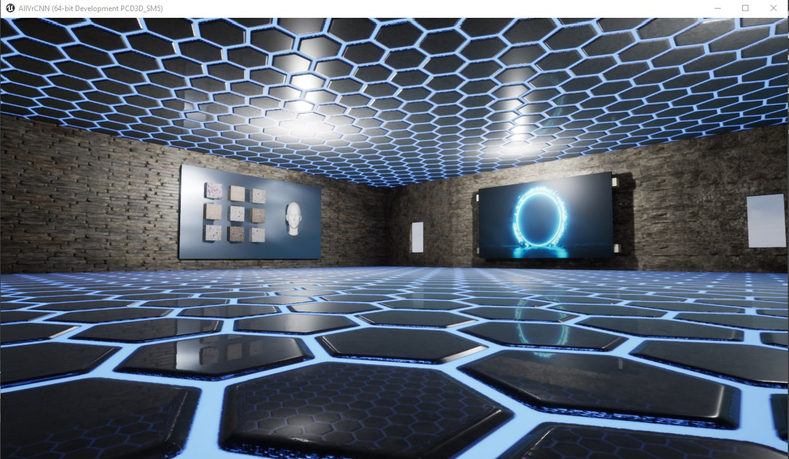

# Peter Moss Acute Myeloid & Lymphoblastic Leukemia AI Research Project

## Acute Lymphoblastic Leukemia Detection System 2020

[](https://github.com/AMLResearchProject/ALL-Detection-System-2020/tree/0.0.2) [](https://github.com/AMLResearchProject/ALL-Detection-System-2020/tree/0.0.3)



&nbsp;

# Introduction

The Acute Lymphoblastic Leukemia Detection System 2020 uses Tensorflow 2 & Oculus Rift to provide a virtual diagnosis system.

This project is made up of a number of components which work together as a network to make the system work. Follow the completed tutorials below in the provided order. The classifiers can be run indvidually but a full system setup requires the [Tensorflow 2.0 CNN](https://github.com/AMLResearchProject/ALL-Detection-System-2020/tree/master/CNN "Tensorflow 2.0 CNN"), [Virtual Reality (Oculus Rift)](https://github.com/AMLResearchProject/ALL-Detection-System-2020/tree/master/Rift "Oculus Rift"), [NLU](https://github.com/AMLResearchProject/ALL-Detection-System-2020/tree/master/NLU "NLU"), and [Arduino IoT Alarm](https://github.com/AMLResearchProject/ALL-Detection-System-2020/tree/master/Arduino "Arduino IoT Alarm") tutorials to be completed.

_This is a high level tutorial for those with little or no programming experience. In future articles I will go into the low level workings of the project._

&nbsp;

# Classifier Results Overview

We have tested our model on a number of different hardwares, including Intel® CPUs & NVIDIA GPUs. Results seem to vary between CPU & GPU, and tests show further investigation into seeding and randomness introduced to our network via the GPU software. For reproducible results every time, it is suggested to train on a CPU, although this obviously requires more time.

One method to overcome reproducibility issues and get an good idea of how well our model is behaving on GPU would be to test the model multiple times and take an average. This is one way we will explore our model in the future.

Below are the results from individual training sessions.

| OS | Hardware | Training | Validation | Test | Accuracy | Recall | Precision | AUC/ROC |
| -------------------- | -------------------- | -------------------- | ----- | ---------- | ---------- | ---------- | ---------- | ---------- |
| Google Colab | Tesla K80 GPU | 1180 |  404 | 20 |  0.9727723 | 0.9727723 | 0.9727723 | 0.9948964 |
| Windows 10 | NVIDIA GeoForce GTX 1060 | 1180 |  404 | 20 |  0.97066015 | 0.97066015 | 0.97066015 | 0.9908836 |
| Ubuntu 18.04 | NVIDIA GTX 1050 Ti Ti/PCIe/SSE2 | 1180 |  404 | 20 |  0.97772276 | 0.97772276 | 0.97772276 | 0.9945594 |
| Ubuntu 18.04 | Intel® Core™ i7-7700HQ CPU @ 2.80GHz × 8   | 1180 |  404 | 20 |  0.9752475 | 0.9752475 | 0.9752475 | 0.991492 |
| Windows 10 | Intel® Core™ i7-7700HQ CPU @ 2.80GHz × 8   | 1180 |  404 | 20 |  0.9851485 | 0.9851485 | 0.9851485 | 0.9985846 |
| macOS Mojave 10.14.6 | Intel® Core™ i5 CPU @ 2.4 GHz   | 1180 |  404 | 20 |  0.9589041 | 0.9589041 | 0.9589041 | 0.99483955 |

&nbsp;

# Clone the repository

Clone the [ALL-Detection-System-2020](https://github.com/AMLResearchProject/ALL-Detection-System-2020 "ALL-Detection-System-2020") repository from the [Peter Moss Acute Myeloid & Lymphoblastic Leukemia AI Research Project](hhttps://github.com/AMLResearchProject "Peter Moss Acute Myeloid & Lymphoblastic Leukemia AI Research Project") Github Organization. 

To do this, make sure you have Git installed, navigate to the location you want to clone the repository to on your device using terminal/commandline, and then use the following command.

The **-b "0.0.3"** parameter ensures you get the code from the latest development branch. Before using the below command please check our latest development branch in the button at the top of this page.

```
  $ git clone -b "0.0.3" https://github.com/AMLResearchProject/ALL-Detection-System-2020.git
```

Once you have used the command above you will see a directory called **ALL-Detection-System-2020** in the location you chose to clone to. In terminal, navigate to the **ALL-Detection-System-2020** directory, this is your project root directory.

&nbsp;

# ALL-IDB

You need to be granted access to use the Acute Lymphoblastic Leukemia Image Database for Image Processing dataset. You can find the application form and information about getting access to the dataset on [this page](https://homes.di.unimi.it/scotti/all/#download) as well as information on how to contribute back to the project [here](https://homes.di.unimi.it/scotti/all/results.php). If you are not able to obtain a copy of the dataset please feel free to try this tutorial on your own dataset, we would be very happy to find additional AML & ALL datasets.

## ALL_IDB1 

In this project, [ALL-IDB1](https://homes.di.unimi.it/scotti/all/#datasets) is used, one of the datsets from the Acute Lymphoblastic Leukemia Image Database for Image Processing dataset. We will use data augmentation to increase the amount of training and testing data we have.

"The ALL_IDB1 version 1.0 can be used both for testing segmentation capability of algorithms, as well as the classification systems and image preprocessing methods. This dataset is composed of 108 images collected during September, 2005. It contains about 39000 blood elements, where the lymphocytes has been labeled by expert oncologists. The images are taken with different magnifications of the microscope ranging from 300 to 500."

&nbsp;

# Build Your Acute Lymphoblastic Leukemia Detection System 2020

Follow the guides below to build your Virtual Reality Acute Lymphoblastic Leukemia Detection System. The classifiers can be used as standalone if required, but this project focuses on the system as a whole.

| Project                                                                                                                                                                                                                                                                                                                                                                      | Description                                                                                                                         | Status      |
| ---------------------------------------------------------------------------------------------------------------------------------------------------------------------------------------------------------------------------------------------------------------------------------------------------------------------------------------------------------------------------- | ----------------------------------------------------------------------------------------------------------------------------------- | ----------- |
| [Rift](https://github.com/AMLResearchProject/ALL-Detection-System-2020/tree/master/Rift "Rift")                                                                                                                                                                                                                                                             | A virtual room made with Unreal Engine 4. In the room the ALL data is displayed as blocks and the user can point at those blocks to classify the image.                      | Development    |
| [NLU](https://github.com/AMLResearchProject/ALL-Detection-System-2020/tree/master/NLU "NLU")                                                                                                                                                                                                                                                             | Hosts a REST API with access to the Natural Language Understanding Engine trained with basic knowledge of AML.                      | Development    |
| [CNN](https://github.com/AMLResearchProject/ALL-Detection-System-2020/tree/master/CNN "CNN") | Applies filters to the original dataset and increases the amount of training / test data. Provides code for training a CNN for detecting ALL. Hosts a REST API endpoint that provides access to the model for inference. | COMPLETE    |
| [Arduino](https://github.com/AMLResearchProject/ALL-Detection-System-2020/tree/master/Arduino "Arduino")                                                                                                                                                                                                                                                             | A virtual room made with Unreal Engine 4. In the room the ALL data is displayed as blocks and the user can point at those blocks to classify the image.                      | Development    |

&nbsp;

# Contributing

The Peter Moss Acute Myeloid & Lymphoblastic Leukemia AI Research project encourages and welcomes code contributions, bug fixes and enhancements from the Github.

Please read the [CONTRIBUTING](https://github.com/AMLResearchProject/ALL-Detection-System-2020/blob/master/CONTRIBUTING.md "CONTRIBUTING") document for a full guide to forking our repositories and submitting your pull requests. You will also find information about our code of conduct on this page.

## Contributors

- **AUTHOR:** [Adam Milton-Barker](https://www.petermossamlallresearch.com/team/adam-milton-barker/profile "Adam Milton-Barker") - [Peter Moss Leukemia AI Research](https://www.leukemiaresearchassociation.ai "Peter Moss Leukemia AI Research") Founder & Intel Software Innovator, Sabadell, Spain

- **TESTER:** [Rishabh Banga](https://www.petermossamlallresearch.com/team/rishabh-banga/profile "Rishabh Banga") - [Peter Moss Leukemia AI Research](https://www.leukemiaresearchassociation.ai "Peter Moss Leukemia AI Research") & Intel Software Innovator, Delhi, India

- **TESTER:** [Javier Lopez Alonso](https://www.leukemiaresearchassociation.ai/team/javier-lopez-alonso "Javier Lopez Alonso") - [Peter Moss Leukemia AI Research](https://www.leukemiaresearchassociation.ai "Peter Moss Leukemia AI Research") Co-Founder, Barcelona, Spain

&nbsp;

# Versioning

We use SemVer for versioning. For the versions available, see [Releases](https://github.com/AMLResearchProject/ALL-Detection-System-2020/releases "Releases").

&nbsp;

# License

This project is licensed under the **MIT License** - see the [LICENSE](https://github.com/AMLResearchProject/ALL-Detection-System-2020/blob/master/LICENSE "LICENSE") file for details.

&nbsp;

# Bugs/Issues

We use the [repo issues](https://github.com/AMLResearchProject/ALL-Detection-System-2020/issues "repo issues") to track bugs and general requests related to using this project. See [CONTRIBUTING](https://github.com/AMLResearchProject/ALL-Detection-System-2020/blob/master/CONTRIBUTING.md "CONTRIBUTING") for more info on how to submit bugs, feature requests and proposals.